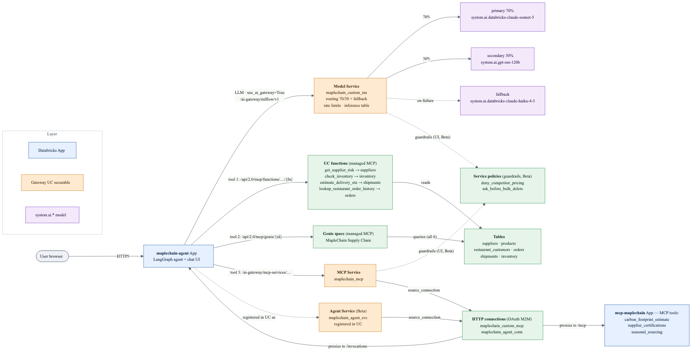

# MapleChain — Unity AI Gateway end-to-end demo

A single, **idempotent** demo of the **new Unity AI Gateway** — where the gateway is a set of
**first-class Unity Catalog securables** governed alongside your data. This demo creates all four
gateway object types — **Model Service, Model Provider Service, MCP Service, and Agent Service**.
The Model Provider Services are optional Microsoft Foundry and Azure OpenAI examples driven by
explicit deployment inputs; the main routed Model Service remains **keyless** across `system.ai.*` models. Themed around
**MapleChain**, a fictional Canadian food-supply business (ambiguously a grocery retailer *or* a
CPG company) whose customers are Canadian restaurants.

> **New vs legacy gateway.** This demo uses `w.ai_gateway.*` → UC objects (docs:
> [learn.microsoft.com/azure/databricks/ai-gateway](https://learn.microsoft.com/en-us/azure/databricks/ai-gateway/)).
> It does **not** use the legacy per-endpoint `serving-endpoints put-ai-gateway` config.
> Routing is **keyless** — across the workspace's `system.ai.*` pay-per-token model services;
> no serving endpoint and no secrets.

Run [`setup.ipynb`](./setup.ipynb) top-to-bottom in a Databricks workspace. Every step is safe
to re-run — UC objects use `CREATE OR REPLACE` / `IF NOT EXISTS`, and gateway objects are
create-else-update.

## What it demonstrates

| Capability | Where | Maturity |
|---|---|---|
| **Managed MCP** — UC functions (auto-governed, no registration) | §2a | GA |
| **Managed MCP** — Genie space (auto-governed; *cannot* be an MCP Service) | §2b | Genie create: Public Preview |
| **MCP Service** — custom App server → UC HTTP connection (OAuth M2M) → MCP Service | §2c, `mcp_app/` | Connections/MCP Service GA (connection scripted via OAuth M2M) |
| **Service policies** (guardrail UDFs) + grants + GA column mask | §2d | Column mask/grants GA; Service Policies Beta (attach UI-only) |
| **Model Service** — deterministic primary + fallback | §3 | GA |
| **Model Provider Service** — Microsoft Foundry, parameterized BYOK | §3b | GA |
| **Model Provider Service** — Azure OpenAI, parameterized BYOK | §3c | GA |
| Fallback across destinations | §3 | GA |
| Rate limits (USER_DEFAULT + SERVICE) | §3 | GA |
| Usage tracking + inference table + request tags | §3, §5, §6 | GA |
| **Classical ML model** — supplier-risk regression registered in UC | §4 | GA |
| Deploy an AppKit React agent workspace as a Databricks App | §4, `agent_app/` | AppKit agents plugin: Beta |
| Wrap the agent as a gateway **Agent Service** | §4 | Beta |
| Seed 20 nested traces (including grouped sessions), an evaluation dataset, and registered scorers | §4-traces | GA |
| Native project-specific coding-agent `SKILL` securables | §4-skills | Preview |

## Architecture



The single **`maplechain_custom_ms` Model Service** routes keylessly to
`databricks-claude-sonnet-5`, with `databricks-claude-haiku-4-5` as **fallback**. The AppKit agent
uses this same deterministic service, preventing provider-specific tool-call behavior from making
an interactive turn nondeterministic. Its governed data tool is the
AppKit Genie plugin; the separately demonstrated UC-function and custom MCP Service assets remain
available to other clients. The custom MCP Service is still proxied to the `mcp-maplechain` App
through its UC HTTP connection. Guardrail **service policies** attach to the Model/MCP Service in
the UI (Beta).

> Diagram source: [`docs/architecture.mmd`](./docs/architecture.mmd) (Mermaid). Regenerate the
> PNG with `mmdc -i docs/architecture.mmd -o docs/architecture.png -b white -s 2`.

## Prerequisites

- Databricks workspace in a **Unity AI Gateway supported region** (not Azure Government).
  Verified end-to-end on Azure workspaces; pass any catalog via `--var 'catalog=<name>'`.
- The Databricks **CLI** (`databricks bundle` / `databricks apps`) and a `--profile` authenticated
  to your target workspace.
- Permission to create UC objects, gateway services (`CREATE SERVICE`), and apps.
- `databricks-sdk` is **pinned to `==0.125.0`** in the notebook (§0), and this must stay an
  **exact** pin, not a floor. Newer SDKs (verified: 0.136.0) have **removed** the Beta
  `AgentService` classes from `databricks.sdk.service.catalog`, so a bare `>=0.125` resolved with
  `-U` breaks §4-agent-service with `ImportError: cannot import name 'AgentService'`. Bump the pin
  only after re-verifying the target SDK still exports `AgentService`/`AgentServiceConfig` from
  `catalog` (0.125.0 resolves cleanly alongside `databricks-agents>=1.9`).

## Retargeting and deployment inputs

Everything location-specific is centralized so a new workspace/catalog is a one-line change:

| To change… | Edit… | Notes |
|---|---|---|
| **Workspace / URL** | the CLI `--profile <name>` | The host lives only in `~/.databrickscfg`, never in the repo. Switching workspace = a different `--profile`. |
| **Catalog / schema** | `variables.catalog` / `variables.schema` in `databricks.yml` | One value flows to **both** the Apps (`config.env`, via `${var.catalog}`) **and** the notebook (job `base_parameters`). Or override per-run: `--var 'catalog=<name>'`. |

The checked-in catalog default is `brlui`, matching the deployed demo in the
`dbw-brlui-stable-cc` workspace. For a new workspace, explicitly pass its target catalog to every
bundle command as shown below; do not assume the checked-in default exists there.

The optional Microsoft Foundry Model Provider Service requires all four inputs below. An agent
performing a future deployment should ask for them before running setup. Put the API key in a
Databricks secret first; never pass the plaintext key as a bundle variable.

| Bundle variable | Value |
|---|---|
| `foundry_base_url` | Microsoft Foundry project/inference base URL |
| `foundry_model` | Foundry model or deployment target |
| `foundry_secret_scope` | Databricks secret scope containing the Foundry API key |
| `foundry_secret_key` | Key within that scope |

All four blank means “skip the provider example.” A partial configuration fails fast.

The optional Azure OpenAI service recreates `catalog.schema.maplechain_azure_mps`. A future
deployment must likewise provide all four values below. Store the API key in a Databricks secret;
the redacted credential on an existing service cannot and should not be exported.

| Bundle variable | Value |
|---|---|
| `azure_openai_base_url` | Azure OpenAI resource URL, for example `https://<resource>.openai.azure.com/` |
| `azure_openai_model` | Azure OpenAI deployment/model target |
| `azure_openai_secret_scope` | Databricks secret scope containing the Azure OpenAI API key |
| `azure_openai_secret_key` | Key within that scope |

All four blank means “skip `maplechain_azure_mps`.” A partial configuration fails fast. When
enabled, setup reproduces the explicit target, native chat/responses APIs, forwarding flags,
inference table, and service/user token limits observed on the reference service.

The checked-in defaults target `https://oneenvazureopenai.openai.azure.com/`, deployment
`gpt-6-astra`, and secret reference `maplechain_demo/azure_openai_api_key`. The API key itself is
never a bundle default: bootstrap that secret in every new workspace before running setup, or
override the scope/key variables with an existing secret reference.

The genie/experiment ids the notebook prints go in the same `variables:` block
(`genie_space_id`, `experiment_id`). Both default to `""` — blank disables the Genie tool and
downgrades MLflow version tracking to a startup warning (not a crash); fill them in after the
first `bundle run setup` using the `--var` flags it prints. The agent's `MODEL_SERVICE` / `MCP_SERVICE` are **derived**
from `UC_CATALOG`+`UC_SCHEMA` in `server/server.ts`, so the catalog is never repeated in a
service name. App env is defined **only** in `databricks.yml` (`config.env`), not in the static
`agent_app/app.yaml` — which is why the apps must be deployed with **`bundle run`** (it applies
`config.env`), not `apps deploy --source-code-path` (which would read the env-less `app.yaml`).

## Run order (bundle-native; `<p>` = your `--profile`)

```bash
# 0. Bootstrap the dedicated gateway OAuth identity locally. This cannot run from serverless
#    notebook credentials. It is idempotent and stores the generated secret in Databricks.
uv run --with databricks-sdk==0.125.0 tasks/bootstrap_gateway_auth.py --profile <p>

# 0b. If the Azure OpenAI provider-service defaults are enabled, store its API key under the
#     default secret reference. The CLI prompts securely; do not put the value on the command line.
databricks secrets put-secret maplechain_demo azure_openai_api_key --profile <p>

# 1. Create the app shells (+ their service principals) + the `setup` job, and sync files.
databricks bundle deploy -t dev --profile <p> --var 'catalog=<catalog>' \
  --var 'foundry_base_url=<url>' --var 'foundry_model=<deployment>' \
  --var 'foundry_secret_scope=<scope>' --var 'foundry_secret_key=<key>' \
  --var 'azure_openai_base_url=<url>' --var 'azure_openai_model=<deployment>' \
  --var 'azure_openai_secret_scope=<scope>' --var 'azure_openai_secret_key=<key>'

# Existing Apps created by an older bundle may require a one-time resize through the asynchronous
# update API before bundle deploy can converge (new workspaces do not need this):
databricks apps create-update maplechain-agent --profile <p> \
  --json '{"update_mask":"compute_size","app":{"compute_size":"LARGE"}}'
databricks apps create-update mcp-maplechain --profile <p> \
  --json '{"update_mask":"compute_size","app":{"compute_size":"LARGE"}}'

# Force a complete source sync. This also repairs stale incremental-sync state after a teardown.
databricks bundle sync --full -t dev --profile <p> --var 'catalog=<catalog>'

# 2. Run the setup notebook as a serverless job. catalog/schema come from var.* automatically.
#    The final cell exits with the Genie space id (§2b) and MLflow experiment id (§4-grants)
#    and prints the exact --var flags to use in step 3.
databricks bundle run setup -t dev --profile <p> --var 'catalog=<catalog>' \
  --var 'foundry_base_url=<url>' --var 'foundry_model=<deployment>' \
  --var 'foundry_secret_scope=<scope>' --var 'foundry_secret_key=<key>' \
  --var 'azure_openai_base_url=<url>' --var 'azure_openai_model=<deployment>' \
  --var 'azure_openai_secret_scope=<scope>' --var 'azure_openai_secret_key=<key>'

# 3. Copy the --var flags printed by setup and redeploy so config.env picks them up:
#      --var 'genie_space_id=<id printed by setup>'
#      --var 'experiment_id=<id printed by setup>'
databricks bundle deploy -t dev --profile <p> --var 'catalog=<catalog>' \
  --var 'genie_space_id=<genie_space_id>' --var 'experiment_id=<experiment_id>' \
  --var 'foundry_base_url=<url>' --var 'foundry_model=<deployment>' \
  --var 'foundry_secret_scope=<scope>' --var 'foundry_secret_key=<key>' \
  --var 'azure_openai_base_url=<url>' --var 'azure_openai_model=<deployment>' \
  --var 'azure_openai_secret_scope=<scope>' --var 'azure_openai_secret_key=<key>'

# 4. Deploy the app source. `bundle run <app>` applies config.env AND starts the app.
databricks bundle run maplechain_mcp -t dev --profile <p> --var 'catalog=<catalog>' \
  --var 'genie_space_id=<genie_space_id>' --var 'experiment_id=<experiment_id>'
databricks bundle run maplechain_agent -t dev --profile <p> --var 'catalog=<catalog>' \
  --var 'genie_space_id=<genie_space_id>' --var 'experiment_id=<experiment_id>'

# 5. (Optional) re-run — idempotent — so the MCP/Agent Services bind to the now-live app backends.
databricks bundle run setup -t dev --profile <p> --var 'catalog=<catalog>' \
  --var 'genie_space_id=<genie_space_id>' --var 'experiment_id=<experiment_id>' \
  --var 'foundry_base_url=<url>' --var 'foundry_model=<deployment>' \
  --var 'foundry_secret_scope=<scope>' --var 'foundry_secret_key=<key>' \
  --var 'azure_openai_base_url=<url>' --var 'azure_openai_model=<deployment>' \
  --var 'azure_openai_secret_scope=<scope>' --var 'azure_openai_secret_key=<key>'
```

Do not skip step 0 on a clean workspace. Serverless notebook runtime credentials cannot mint an
account-level service-principal secret; setup validates that `maplechain-gateway-sp` and the
`maplechain_demo/sp_client_id` + `sp_secret` keys already exist and fails with a direct remediation
message otherwise.

- §3 of the notebook creates the single deterministic **Model Service**
  (`catalog.schema.maplechain_custom_ms`) — a UC object with no serverless endpoint to wait on —
  and removes the superseded `maplechain_agent_ms` during upgrades. §4-grants grants the agent's SP UC schema access,
  **`EXECUTE` on the Model Service**, **`CAN_RUN` on the Genie space**, and `CAN_MANAGE` on its
  MLflow experiment (without the UC/Model Service grants the agent gets
  `INSUFFICIENT_PERMISSIONS`/`PERMISSION_DENIED` on tool calls; a missing or wrong `experiment_id`
  logs a startup warning but does not crash the app).
- §3b creates `catalog.schema.maplechain_foundry` when all Foundry inputs are supplied. The API
  key is read using `dbutils.secrets.get` and never persisted in source or bundle state.
- §4 registers `catalog.schema.supplier_risk_model`, a conventional scikit-learn regression
  model. The conversational agent exists only as an App and gateway Agent Service. §4-traces
  seeds 20 representative nested traces across five sessions, a managed UC evaluation dataset,
  and built-in/custom-code/custom-LLM-judge scorers. §4-skills creates three native coding-agent
  skills in the target schema for bundle deployment, gateway debugging, and evaluation curation.
- Both Databricks Apps are declared with `compute_size: LARGE` (the API name for the **XL** UI
  tier); every bundle deployment preserves that sizing in a new workspace.
- Opening **`maplechain-agent`**'s URL shows the enterprise **AppKit React chat UI** (streaming status,
  formatted responses, governed-tool activity, retry/copy actions, responsive layout, and explicit execution identity;
  see `agent_app/README.md`). **`mcp-maplechain`** is an **MCP endpoint only** — like the upstream
  hello-world template it has no web page, so `/` returns 404 by design; it's consumed by the agent
  and the MCP Service, not opened in a browser. Its protocol lives at `/mcp`.
- The apps are gated by workspace OAuth (SSO), so a browser is the normal client. To invoke
  headlessly, mint an OAuth token for the gateway SP (its client id/secret are in the
  `maplechain_demo` secret scope) via `POST /oidc/v1/token` (client_credentials, scope `all-apis`)
  and call `<app-url>/invocations` with `{"input":[{"role":"user","content":"…"}]}`. Setup
  grants this identity `CAN_USE` on the App, `CAN_RUN` on the Genie space, and read access to the
  demo schema because AppKit preserves the calling principal for Genie authorization.

> **Switching to a brand-new workspace on the same target?** DABs keeps Terraform state per
> workspace; if a re-point trips a `workspace_id mismatch`, clear the local cache with
> `rm -rf .databricks/bundle/dev` and redeploy.

## Manual / UI-based steps (to complete the end-to-end demo)

The notebook + bundle automate everything the API allows. Two things remain:

1. **Attach a service policy (guardrail) — UI-only, Beta.** §2d *creates* the policy UDFs
   (`deny_competitor_pricing`, `ask_before_bulk_delete`) and lists the built-ins
   (`system.ai.block_unsafe_content` / `block_jailbreak` / `block_hallucination`), but **attaching**
   one has no API yet. In the workspace: **AI Gateway → the Model Service (or MCP Service) →
   Policies → New policy →** pick a built-in or `catalog.schema.deny_competitor_pricing` → set the
   phase (request/response), rank, and principals → **Save**. Until you do this, §5's "guardrail"
   call just answers normally — nothing is blocked.
2. **Complete OAuth for a connection only if you change its auth type.** The demo uses **OAuth M2M**
   (fully scripted). If you instead switch a connection to **DCR** or **User-to-Machine** auth, that
   requires a one-time **Login** in Catalog Explorer → the connection → **Login**.

## Repo layout

```
setup.ipynb        Idempotent orchestrator (§0–§6). Generated by build_notebook.py.
build_notebook.py  Source of truth for setup.ipynb — edit here, then regenerate.
mcp_app/           Custom MCP server (FastMCP) → Databricks App → UC connection → MCP Service.
agent_app/         AppKit beta agents + React enterprise chat → Databricks App; LLM = Model Service.
databricks.yml     Bundle + SINGLE SOURCE OF TRUTH: variables (catalog/schema/ids), both apps, setup job.
tasks/             Build notes + standalone verify scripts (verify_model_service.py, verify_uc.py, …).
```

## Notes & caveats (verified live)

- **Keyless routing**: the Model Service routes across `system.ai.*` pay-per-token model
  services via `pay_per_token_config` — no keys, no secrets, no serving endpoint. Model refs are
  irregular (`databricks-claude-sonnet-5` vs `gpt-oss-120b`), so the notebook **resolves them
  dynamically** from `list_model_services()`.
- **Invoke a Model Service** at `https://<host>/ai-gateway/mlflow/v1` with
  `model="<catalog.schema.name>"` (OpenAI-compatible). `ChatDatabricks(model=FQN,
  use_ai_gateway=True)` does this for the agent.
- **Service Policies are Beta and attach only in the UI.** The notebook *creates* the custom
  guardrail UDFs (`event VARIANT → VARIANT` returning ALLOW/DENY/ASK) and prints the built-in
  `system.ai.block_*` names + attach steps; it does not assert a block.
- **VARIANT policy UDFs break the schema-level managed MCP server** ("Unsupported parameter type:
  VARIANT"). So for the UC-function tools the agent registers each function by its **per-function**
  MCP URL (`/api/2.0/mcp/functions/{cat}/{sch}/{fn}`) rather than the schema-level URL. (This is one
  of the agent's three tool sources — the Genie MCP and custom MCP Service are the other two.)
- **Custom MCP / Agent Service connections are scripted via OAuth M2M** — no UI handshake. The
  App backends require an OAuth login, so §2c-sp provisions a dedicated service principal
  (`maplechain-gateway-sp`), mints its OAuth secret into the `maplechain_demo` secret scope, and
  grants it `CAN_USE` on both Apps. The UC HTTP connections then use client-credentials
  (`client_secret secret('maplechain_demo','sp_secret')`) — the secret is **referenced, never
  embedded** in the connection object. Only the *interactive* DCR / User-to-Machine connection
  auth types are UI-only; **bearer token and OAuth M2M are creatable from SQL/SDK/CLI**.
- **Connection resource names are metastore-level**: reference a connection as
  `connections/<name>` (single-level), **not** `connections/<catalog>.<schema>.<name>`.
- **Agent Service `model_service` is not yet settable on create** (Beta, SASP-8317). The Agent
  Service is registered with its `source_connection` + `system_prompt` + `base_path`; the agent
  App still routes its LLM through the Model Service via `ChatDatabricks(use_ai_gateway=True)`.
- **Agent Services are Beta and hidden from global search.** A created Agent Service won't appear
  in Catalog **search**; open it by navigating directly to its schema in Catalog Explorer, and
  only if you hold `READ_METADATA`/`EXECUTE` on it (grant those — the owner-only default hides it).
- **Managed MCP servers cannot be registered as MCP Services.** `create_mcp_service` is only for
  **external/custom** MCP servers reached via a UC HTTP connection (the `mcp_app/` server).
  Databricks-managed MCP — **UC functions, Genie spaces, Vector Search** — is already governed and
  consumed directly at its managed URL (`/api/2.0/mcp/genie/{id}`, `/api/2.0/mcp/functions/…`);
  there is no connection and nothing to register.
- **Agent ↔ gateway**: AppKit's beta `agents()` plugin consumes the gateway chat-completions SSE stream and
  exposes its thread-aware `/api/agents/chat` stream to the React client. Gateway
  policy configuration may buffer some upstream tokens; guardrail failures still surface as a
  friendly assistant response rather than a raw 500.
- **Genie timeout**: the agent App sets `GENIE_TIMEOUT_MS=600000` in the bundle. Genie can remain
  in `ASKING_AI` for several minutes during warehouse startup or query planning; the shorter
  AppKit default can cancel otherwise healthy requests. The agent's tool-call deadline is kept
  30 seconds above this value in `agent_app/server/server.ts`.
- **Usage / inference tables** populate within ~1 h of the first request — re-run §6 later.

## Regenerating the notebook

```bash
python build_notebook.py
```
